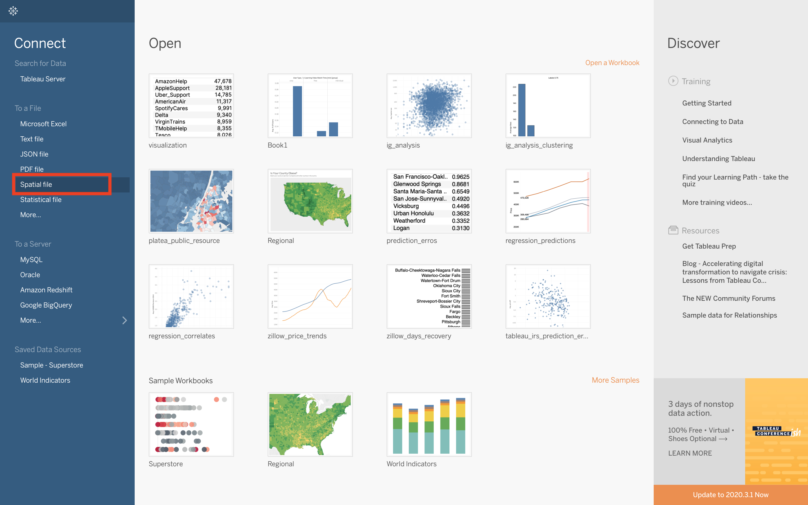
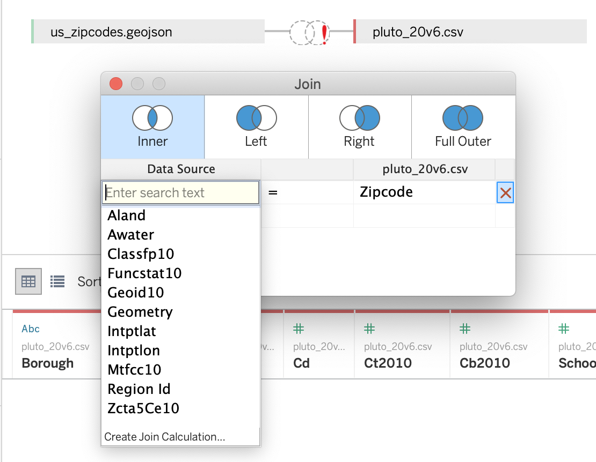
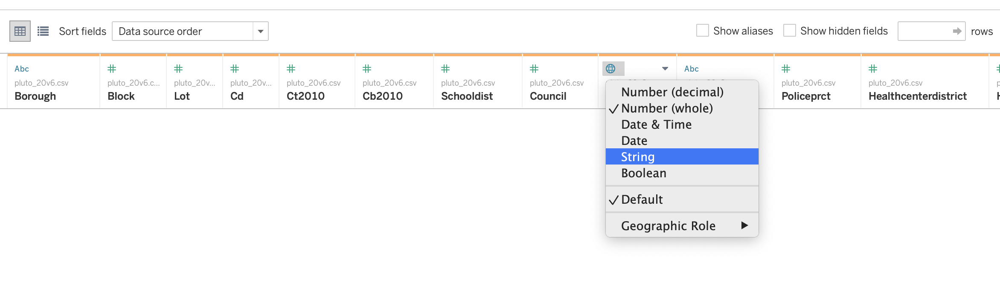

## Downloading and mapping PLUTO data with Tableau

What is PLUTO data? PLUTO stands for Primary Land use Tax lot Output and is a rich dataset provided by the planning department of New York City. It has information on a properties square-footage, retail space, number of residential units, FAR, etc. In this tutorial we will download PLUTO data from the [NYC Planning Data portal](https://www1.nyc.gov/site/planning/data-maps/open-data.page) and visualize it in Tableau.

### Step 1: downloading PLUTO data
We will begin by heading to the NYC Planning website to get the [PLUTO data](https://www1.nyc.gov/site/planning/data-maps/open-data/dwn-pluto-mappluto.page). Click the download button under version **Release 20v6** – note: next to download is a data dictionary, this provides information as what each of the columns in the PLUTO dataset indicate. For example, according to the data dictionary *ResArea* is the total residential floor area for a property. It is worth checking the data dictionary to get an understanding of the information available for any future analysis you do with this data, for the purposes of this tutorial we will mostly ignore it. Once your download is complete, unzip the folder in a suitable location.

### Step 2: downloading US zip code data
For the purposes of this example, we will visualize the PLUTO data at zip code level. To do this we will need zip code geometries. Use [this link](https://drive.google.com/file/d/16b3l5_JwUNwr4T9nqoBjKLB30miB6i2-/view?usp=sharing) to download zip codes for the entire US (the file is ~1.4GB).

### Step 3: Merging data in Tableau
Next we will combine the two datasets we previously downloaded in Tableau. When you open Tableau the left pane has various buttons for connecting to different data types: as we are working with zip code geometries (in Geo JSON format), click the **Spatial file** button. Locate the **us_zipcodes.geojson** file and click open.

Then in the left pane click **Add** -> **Text file** and locate locate and open the **pluto_20v6.csv** file.

Once you have the two files loaded into Tableau, click on the two overlapping circles in between the two tables (this is how you tell Tableau which columns to join on). Click the dropdown under **Data Source** and then select the **Regio Id** column, and then click the dropdown under **pluto_20v6.csv** and select the **Zipcode** column.

Notice the red exclamation mark on the overlapping circles, this means that there is a mismatch in column data types. To fix this select the small circle above the left side of the **Zipcode** column along the bottom pane and hit **String**.

